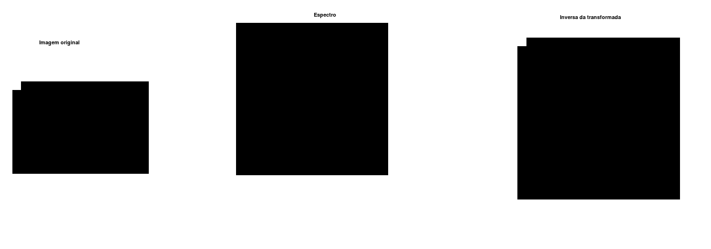
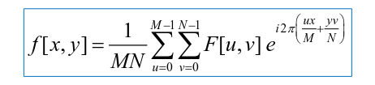
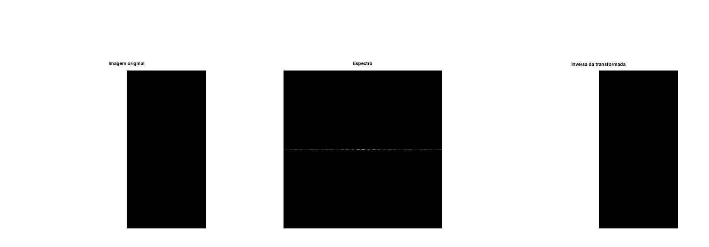
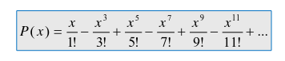
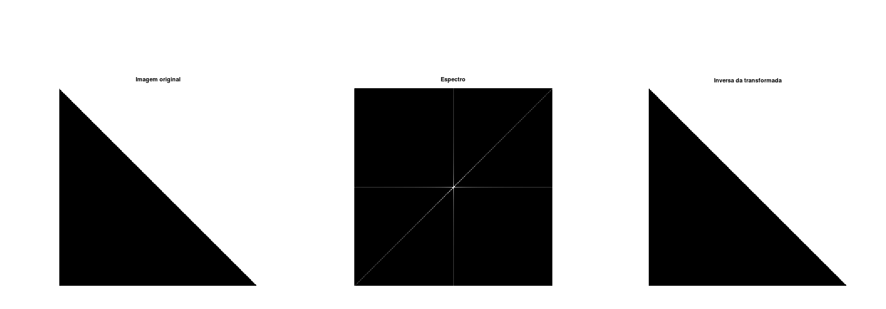
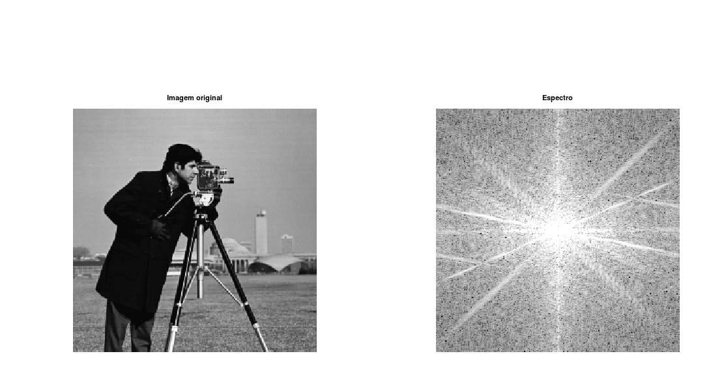
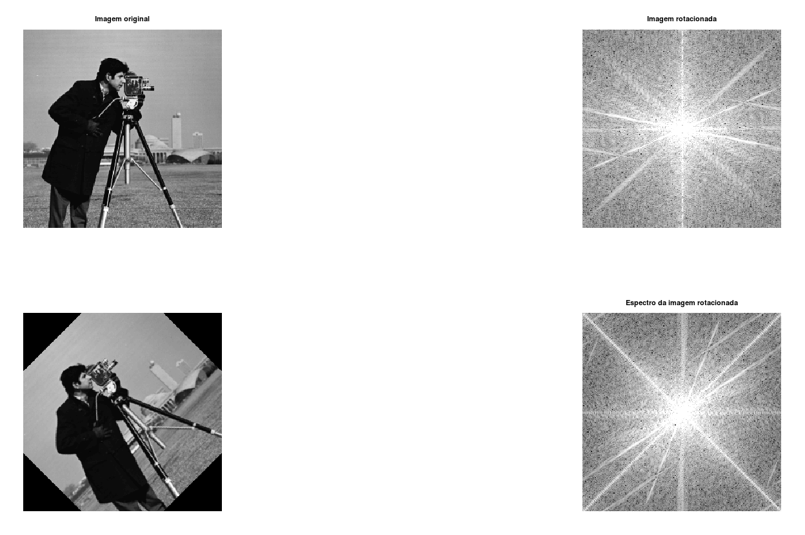
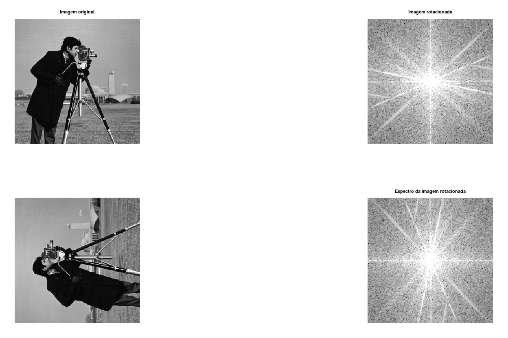
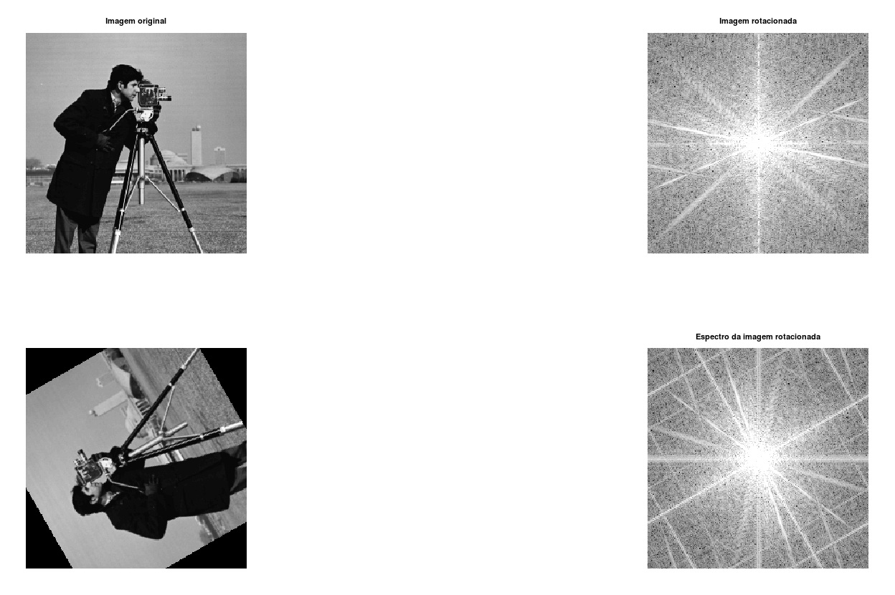

# Fundamentos de Processamento de Imagens

## Laboratorio 3

Nome: João Pedro Cosme da Silva / Cartão 0031472

## Introdução

O presente relatório tem como objetivo demonstrar as atividades realizadas no Laboratorio 3, com o objetivo de criar uma intuição sobre a representação dos espectros obtidos através da utilização da transformada de Fourier.

## Método Base

O método utilizado para obter os resultados amostrados abaixo, é o seguinte:

```matlab
function show_image_and_fft(path)

    figure();
    subplot(1,3,1);
    img = imread(path);
    imshow(img);
    title("Imagem original");
    subplot(1,3,2);
    imshow(log(abs(fftshift(fft2(img)))),[]);
    title("Espectro");
    subplot(1,3,3);
    inversa = ifft2(fft2(img));
    imshow(inversa);
    title("Inversa da transformada");
```

## Delta Origin e White Square

### Função Impulso em 2D

Conforme pode ser visto na imagem abaixo, uma função impulso em 2D é representada por um único pixel na origem (que em 2D se situa em (0,0)). Porém, diferente do que foi visto no domínio frequência, aqui a função impulso está escalada em 255, isso foi realizado para facilitar sua visualização a olho nu, já que um pixel com uma intensidade tão baixa quanto 1 não seria facilmente percebido. Nesta primeira imagem, foi realizado um _zoom_ para que se pudesse verificar o pixel de origem.



<p align = "center">
Imagem 1: Delta
</p>

O mesmo vale para a função constante (White Square). Que no domínio frequência seria um sinal constante de valor _1_.


<p align = "center">
Imagem 2: White Square
</p>

## Relação entre as funções

Ambas representam possíveis operações que poderíamos realizar quando estamos trabalhando com sinais no domínio frequência. A função impulso seria usada para multiplicar um sinal no domínio frequência a fim de amostra-lo, já a função constante serviria para reproduzirmos exatamente o sinal fonte.

Pelo Teorema da Convolução, pode-se entender que ambas as imagens vistas poderiam ser usadas para realizar exatamente o mesmo processo (de amostragem e operação neutra) no domínio espacial, porém ao invés de uma multiplicação ponto a ponto no domínio frequência, aqui deveríamos realizar operações de convolução e escalar o resultado dividindo-o por 255 para que obtivéssemos o mesmo resultado.

## Recuperação das Imagens Originais

Como podemos ver nas imagens acima, é possível sim recuperar as imagens originais através da aplicação da transformada inversa de Fourier. Isso se dá devida a linearidade da transformada de Fourier e a preservação da energia original da imagem.

<div style="page-break-after: always;"></div>

## Transformada Inversa

Os resultados abaixo foram obtidos através do uso do seguinte código:

```matlab
    figure()
    img = imread("bw_delta_origin.bmp");
    subplot(1,2,1);
    imshow(abs(ifft2(img)));
    title("Inversa do Delta");
    img = imread("bw_white_sqr.bmp");
    subplot(1,2,2);
    imshow(abs(ifft2(img)));
    title("Inversa do Quadrado Branco");
```

Resultado:


<p align = "center">
Imagem 3: Inversas do Delta e da função Constante
</p>

Como podemos visualizar, a inversa da função delta_origin é uma imagem bastante escura. Já a inversa da imagem do quadrado branco é uma função constante que se encontra na origem, isso se deve ao fato de que a transformada de Fourier de um filtro pente é uma função constante, logo, a inversa de uma função constante deveria ser um filtro pente. Logo, se confirma experimentalmente esta propriedade.

A IDFT para o dominio do 2D é a seguinte, conforme retirado dos slides da disciplina:



<p align = "center">
Imagem 4: IDFT em 2D
</p>

O valor `c = 0.0039`, se dá devido a escalação do resultado obtido por $\frac{1}{MN}$, que neste caso resulta no valor $\frac{1}{255 \times 255}$. Porém, o resultado final ainda deve ser escalado em 255 (já que o sinal de origem está escalado nesta proporção), resultando assim no valor de c encontrado.

## DFT de Imagens Periodicas Horizontais e Verticais

Conforme pode ser visto na imagem abaixo, o resultado da aplicação da transformada de Fourier as imagens onde há sinais puramente verticais ou horizontais. Em ambos os casos, após a aplicação de `fftshift`, obtivemos um tracejado iniciado na origem e reduzindo a medida que se afasta dela. Para estes resultados, foi utilizada a função `show_image_and_fft`.


<p align = "center">
Imagem 5: Horizontal
</p>



<p align = "center">
Imagem 6: Vertical
</p>

Isso ocorre pois a aproximação de uma onda quadrada, conforme visto em aula, é uma função puramente imaginaria (ou seja, composta apenas por senos), cuja representação é dada pela série Taylor centrada em zero, com os seguintes valores:



<p align = "center">
Imagem 7: Aproximação da função seno
</p>

A imagem obtida utiliza o comando `abs`, logo é possivel verificar as componentes negativas deste polinômio, porém, é possivel verificar que as componentes com divisores par desta função são zero.

## Relação entre arestas no dominio frequencia e a imagem fonte

Podemos observar que, ao aplicarmos a transformada de fourier em imagens onde existem arestas bem definidas, surge uma reta com mesma orientação da função de transição de origem. Por exemplo, na imagem `bw_vertical`, quando a imagem é visualizada enquanto um periodo de um sinal de origem caracterizado por infinitas copias de mesma imagem, percebe-se que não há transição de valores no sentido vertical. Porém, no sentido horizontal temos a constante transição(abrupta) entre os valores 255 e 0, o que gera a reta vista no espectro, conforme descrito no item anterior.

Já aplicando a função `show_image_and_fft`, a imagem `bw_triangle.bmp`, temos o seguinte resultado:



<p align = "center">
Imagem 7: Triangulo
</p>

Aqui, podemos ver que além das retas descritas nas imagens anteriores, apresentamos uma nova linha diagonal de _sentido oposto_ a alteração vista em tela. Este resultado se dá ao fato de que, ao contrario das imagens anteriores, começamos a ter mudanças simultaneas nos dois sentidos, logo, começamos a ter componentes reais nos coeficientes que geram esta aresta no dominio frequencia.

## Espectro do Cameraman

A imagem abaixo foi gerada utilizando a função `show_image_and_fft`, porém omitindo a sua inversa já que não é interessante para esta discussão.



<p align = "center">
Imagem 8: Cameraman
</p>

Aqui, podemos ver um especto bem mais rico e diverso que o visto anteriormente, devido a quantidade de detalhes vistos na imagem original. Agora, podemos começar a perceber a correlação entre algumas fontes originais.

Suponho que as linhas nas diagonais se formem principalmente devido as transições tanto entre o cameraman e o fundo, como quanto entre a o tripé da camera e o fundo.

<div style="page-break-after: always;"></div>

## Rotação do Cameraman

Aqui, a seguinte função foi utilizada para os experimentos:

```
function show_rotated_image(degrees)

    figure();
    subplot(2,2,1);
    img = imread("cameraman.tif");
    imshow(img);
    title("Imagem original");
    subplot(2,2,2);
    imshow(log(abs(fftshift(fft2(img)))),[3 10]);
    title("Espectro");
    cman_rot = imrotate(img, degrees, 'bilinear', 'crop');
    title("Imagem rotacionada");
    subplot(2,2,3);
    imshow(cman_rot);
    subplot(2,2,4);
    imshow(log(abs(fftshift(fft2(cman_rot)))),[3 10]);
    title("Espectro da imagem rotacionada");
```

Abaixo, seguem os resultados para 45, 90 e 120 graus de rotação:


<p align = "center">
Imagem 9: Cameraman em 45 graus
</p>

<div style="page-break-after: always;"></div>



<p align = "center">
Imagem 10: Cameraman em 90 graus
</p>

<div style="page-break-after: always;"></div>



<p align = "center">
Imagem 11: Cameraman em 120 graus
</p>

Podemos perceber, na rotação de 90 graus, que o espectro da imagem rotacionada em 90 graus corresponde precisamente a se rotação da imagem do espectro da imagem original. Isto é possivel devida a linearidade da transformada de Fourier, onde podemos ver que, mesmo deslocando os pixeis originais, ainda obtivemos a mesma transformada.

Já nas imagens de 45 e 120 graus, podemos perceber que novos elementos foram adicionados ao espectro. Isso se deve as novas bordas geradas pelo matlab para ajustar a imagem rotacionada a moldura. Dessa forma, a DFT repete estes "vacuos" em seu entendimento da função imagem, e, ao aplicar a DFT, também representa estas transições no dominio frequencia.
