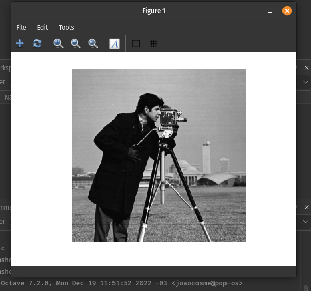
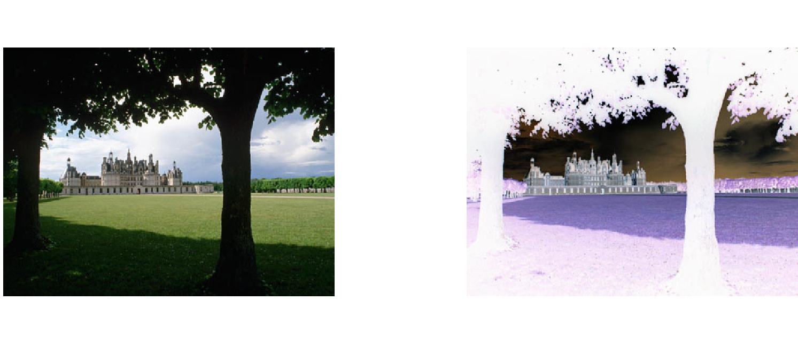

# Fundamentos de Processamento de Imagens

## Relatório Ilustrado – Laboratório 1

Nome: João Pedro Cosme da Silva / Cartão 0031472

## 1 Comando `imshow` e `imread`

Conforme visto em aula, mostra a imagem carregada:



<div style="page-break-after: always;"></div>

## 2 Cálculo de Negativo

O MatLab / Octane (equivalente que pode ser utilizado em Linux), permite a aplicação de uma mesma operação sobre todos os pontos de uma imagem, dessa forma, o trecho abaixo exibe todo o processo necessário para o cálculo de negativo e apresentação do resultado:

```matlab
>> figure;
>> subplot(1,2,1);
>> imshow(i);
>> subplot(1,2,2);
>> imshow(255-i);
```


## 3 Negativo para nova imagem

Segue o resultado da operação de negativo sobre a nova imagem carregada:



<div style="page-break-after: always;"></div>

## 4 Convoluções

Usando o comando `conv2` do matlab, podemos facilmente aplicar um filtro de convolução sobre uma imagem qualquer.

### 4.1 Filtro Gaussiano

Conhecido como um filtro passa-baixa, podemos verificar a aplicação deste filtro causa um *blur* sobre nossa imagem.

```matlab
image = imread(file_name);

G = [0.0625 0.125 0.0625; 0.125 0.25 0.125; 0.0625 0.125 0.0625];

i_fg = image;

for i=1:3
    i_fg = conv2(i_fg,G);
end

figure;
subplot(2,1,1);
imshow(image);
subplot(2,1,2);
imshow(uint8(i_fg));
```

Acima, podemos ver o trecho de código para a aplicação desta convolução utilizando o MatLab. Como executamos uma operação de ponto flutuante (visto que os valores do filtro são deste tipo), ao final, temos que reconverter a imagem para *unassigned int 8* para que possamos apresentar a imagem.


Aplicando o filtro três vezes seguidas, obtemos um resultado ainda mais borrado. Além disso, devido a aplicação sucessiva de convoluções, que não são aplicadas nas bordas devido ao "encaixe" do filtro sobre essas areas, vemos uma borda surgindo.


<div style="page-break-after: always;"></div>

### 4.2 Filtro LaPlaciano

Conhecido como filtro passa-alto, este filtro nos mostra as arestas apresentadas na imagem.

Para este item e itens posteriores, a seguinte função `read_and_conv` foi desenvolvida e utilizada:

```matlab
function conv_image = read_and_conv(image_name, kernel)
    image = imread(image_name);
    
    [row,columns,num_channels] = size(image);
    
    if (num_channels == 1)
        conv_image = conv2(double(image), double(kernel));
    else
        conv_image = convn(double(image), double(kernel));
    end
    
    figure;
    subplot(2,1,1);
    imshow(image);
    subplot(2,1,2);
    imshow(uint8(conv_image));
    
   conv_image = uint8(conv_image);
```

Aplicando o filtro $Lp$, temos o seguinte resultado:


Já adicionando o filtro $Ln$, temos o seguinte resultado:


<div style="page-break-after: always;"></div>

Neste ultimo, podemos ver mais detalhes aos elementos que estão no fundo da imagem, com suas bordas mais destacadas se compadas ao filtro $Lp$

### 4.3 Filtro HighBoost

Utilizando este filtro, junto da soma de 127 ao final do processamento, temos um efeito de superposição das arestas sobre a imagem base. Dessa forma, se assemelha a desenhos, onde as arestas são feitas em traçados bem definidos.


<div style="page-break-after: always;"></div>

### 4.4 Prewitt Horizontal

Utilizando este filtro, criamos um efeito de contraste acentuado na extremidade esquerda dos artefatos, gerando um efeito de "relevo".


Somando 127, temos um efeito de


Já invertendo os sinais de $Ph$, temos um efeito de contrastes na extremidade contrária da imagem.

<div style="page-break-after: always;"></div>

Já somando 127, temos o seguinte efeito


### 4.5 Prewitt Vertical

Este filtro gera um efeito visual de relevo nas imagens, só que dessa vez um relevo relacionado as linhas *horizontais* da imagem.


Invertendo, obtemos:


<div style="page-break-after: always;"></div>

## 5 Computação de Gradiente

Realizando a computação  utilizando o seguinte código

```matlab
function grad = mag_grad(image_name)
    Ph = [-1 0 1; -1 0 1; -1 0 1];
    Pv = [-1 -1 -1; 0 0 0; 1 1 1];

    image = imread(image_name);
    [row, columns, num_channels] = size(image);

    if (num_channels == 1)
        ph_image = conv2(double(image), double(Ph));
        pv_image = conv2(double(image), double(Pv));
    else
        ph_image = convn(double(image), double(Ph));
        pv_image = convn(double(image), double(Pv));
    end

    grad1 = ph_image;

    for x = 1:(row*columns)
        grad1(x) = sqrt((ph_image(x)*ph_image(x))+(pv_image(x)*pv_image(x)));
    end

    figure;
    subplot(1, 2, 1);
    imshow(image);
    subplot(1, 2, 2);
    imshow(uint8(grad1));
```

Obtendo o seguinte resultado:


### 6 Computação de Gradiente com Comando .*

Com a o código abaixo, alterado para computar o gradiente em uma linha, segue abaixo:

```matlab
function grad = mag_grad_one(image_name)
    Ph = [-1 0 1; -1 0 1; -1 0 1];
    Pv = [-1 -1 -1; 0 0 0; 1 1 1];

    image = imread(image_name);
    [row, columns, num_channels] = size(image);

    if (num_channels == 1)
        ph_image = conv2(double(image), double(Ph));
        pv_image = conv2(double(image), double(Pv));
    else
        ph_image = convn(double(image), double(Ph));
        pv_image = convn(double(image), double(Pv));
    end

    grad1 = ph_image;

    grad1 = sqrt(ph_image.*ph_image + pv_image.*pv_image);

    figure;
    subplot(1, 2, 1);
    imshow(image);
    subplot(1, 2, 2);
    imshow(uint8(grad1));

```

Podemos ver que obtemos o mesmo resultado que apresentado no item anterior:


