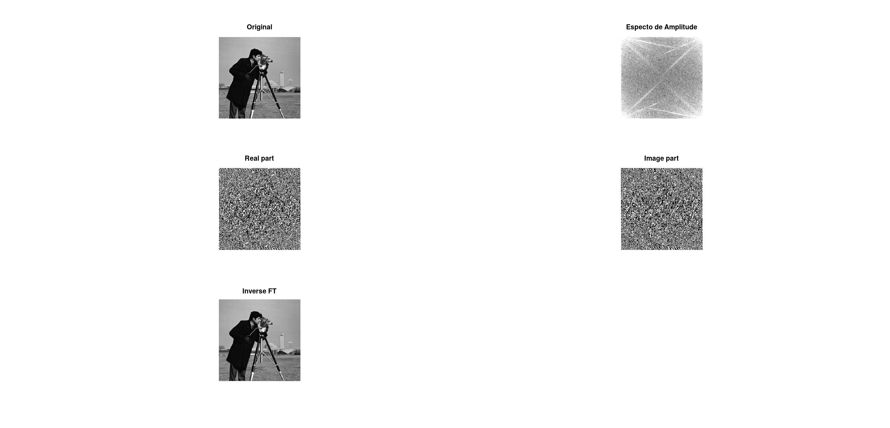
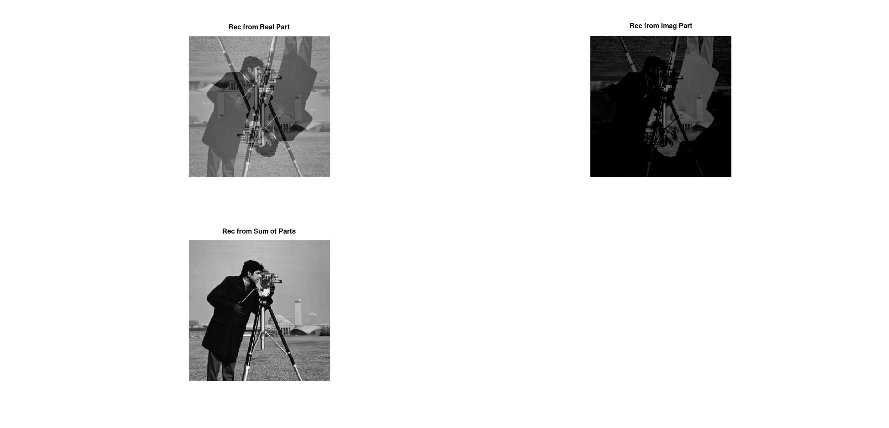
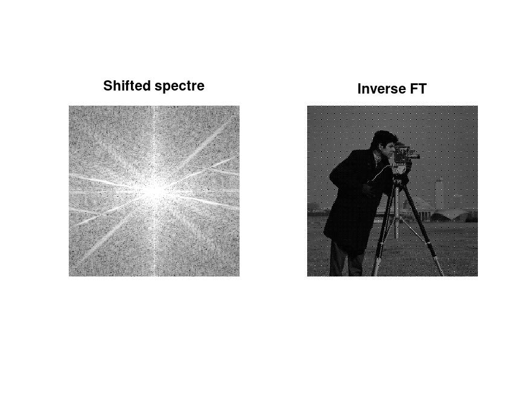
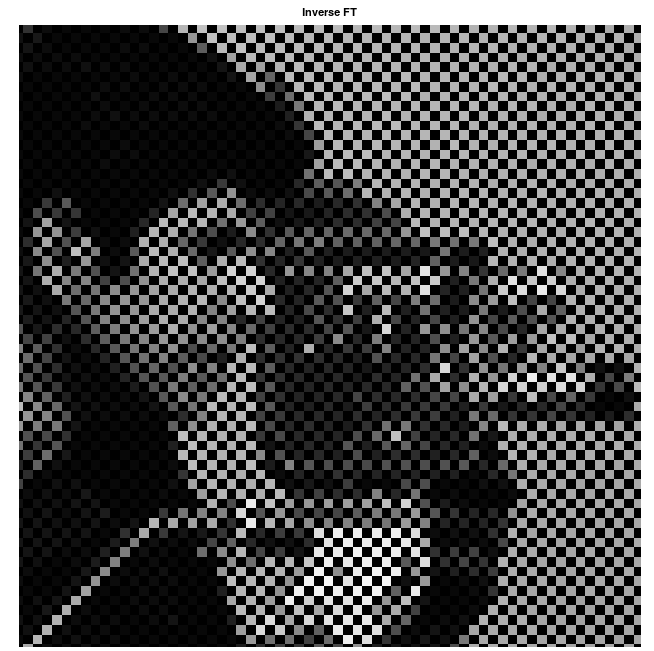
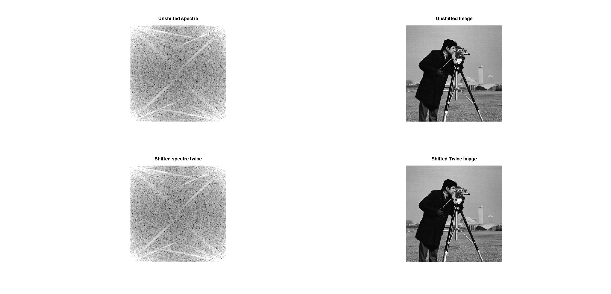

# Fundamentos de Processamento de Imagens

## Relatório Ilustrado – Laboratório 2

Nome: João Pedro Cosme da Silva / Cartão 0031472

### Questão 2

Para exibir as partes reais e imaginarias de um número complexo, gerado pela transformada rápida de Fourier, podemos utilizar os seguintes comandos:

```matlab
cman_ft = fft2(cman);

cman_real = real(cman_ft);
cman_imag = imag(cman_ft);

subplot(3,2,3);
imshow(uint8(cman_real));
title("Real part");

subplot(3,2,4);
imshow(uint8(cman_imag));
title("Image part");
```

Podendo obter os resultados conforme visto nas imagens `Real Part` e `Image Part` abaixo:



<p align = "center">
Imagem 1: Questões 2 a 4
</p>

Quando aplicamos a transformada de Fourier em uma imagem, ela é transformada do dominio espacial para o dominio frequencia, representados por numeros complexos. Conforme visto, qualquer sinal pode ser representado por uma soma de senos e cossenos de diferentes magnitudes. A parte real da imagem, representa os coeficientes $\frac {au} 2 $ (referentes aos cossenos utilizados para reconstruir o sinal). Já a parte imaginaria representa os coeficientes $\frac {bu} 2 $ (referentes aos cossenos utilizados para reconstruir o sinal).

Porém, como visualizamos estes números através de sua conversão para inteiros de 8 bits, a imagem se torna apenas ruído que não nos diz muito diretamente.

### Questão 3

O espectro de amplitude recuperado pelo comando `imshow(log(abs(cman_ft)),[3 10]` pode ser visto na Imagem 1 acima.

Este espectro, mostrado em questões de valores absolutos e normalizados utilizando a função $log$, representa o quanto cada frequência impacta na imagem final.

### Questão 4

Ao aplicarmos a função `fft2`, levamos uma imagem do domínio frequência para o domínio espacial. Como essa transformação preserva os coeficientes de suas componentes de seno e cossenos, se supõe que ao aplicarmos a inversa da transformada de Fourier seriamos capazes de recuperar a imagem original **sem distorções**.

Conforme visto na imagem um, sob o titulo de `Inverse FT`, podemos validar que ao aplicarmos o comando `ifft2` este é sim o caso e que a transformada de Fourier funciona corretamente para a transformação entre os dois domínios.

### Questão 5

Para recuperarmos separadamente as componentes reais (com a parte imaginaria zerada), e a parte imaginaria (com a parte real zerada), devemos executar as duas primeiras linhas de código a seguir. Multiplicamos a parte imaginária por $i$, ainda, pois a função `imag` retorna um numero real, e desejamos um numero complexo.

```matlab
cman_recon_from_real = ifft2(real(cman_ft));
cman_recon_from_imag = ifft2(imag(cman_ft)*i);

figure();
subplot(2,2,1);
imshow(uint8(cman_recon_from_real));
title("Rec from Real Part");

subplot(2,2,2);
imshow(uint8(cman_recon_from_imag));
title("Rec from Imag Part");
```

O resultado obtido pode ser visto na imagem 2 abaixo, nas figuras `Rec From Real Part` e `Rec from Imag Part`



<p align = "center">
Imagem 2: Questões 5 e 6
</p>

Podemos notar que as imagens apresentam um efeito de _espelhamento_ . Isso se dá pois, para cada imagem, recuperamos apenas a parte dos senos ou cossenos vezes seus respectivos componentes. Dessa forma, nenhuma delas apresenta a imagem completa. Esse espelhamento também ocorre, pois, como representamos a imagem de forma periódica.

Ainda, a imagem reconstruída a partir da parte imaginaria se mostra mais escura, pois apresenta diversos valores negativos que são representados como zero.

REVER ESTA PARTE DO VIDEO

### Questão 6

Somandos as componentes reais e imaginarias obtidas separadamente abaixo, podemos soma-las e ainda sim produzir a imagem original. Isto se dá pois, mesmo recompondo separadamente a porção real e a porção imaginaria dos numeros gerados pela transformada de Fourier, os valores no dominio frequencia já haviam sido decompostos dessa forma e mesmo anulando determinadas frequencias em cada recomposição, podemos uni-las novamente e obter o resultado original.

Usando o seguinte código, podemos obter exatamente esse resultado, conforme visto na figure `Rec from Sum of Parts` da imagem dois:

```matlab
subplot(2,2,3);
cman_sum = cman_recon_from_imag + cman_recon_from_real;
imshow(uint8(cman_sum));
title("Rec from Sum of Parts");
```

### Questão 7

Ao aplicarmos o comando `fftshift`, sobre o resultado da transformada de Fourier, podemos exibir seu resultado utilizando o seguinte código:

```matlab
figure();
subplot(1,2,1);
cman_ft_shift = fftshift(cman_ft);
imshow(log(abs(cman_ft_shift)),[3 10]);
title("Shifted spectre")
```

Na Imagem 3 abaixo, na figura `Shifter Spectre`, podemos ver o espectro de amplitude com as frequências menores, que antes se concentravam nas extremidades do espectro original, centralizados no centro da imagem. Dessa forma, conforme nos aproximamos das bordas podemos encontrar frequencias mais altas



<p align = "center">
Imagem 3: Questões 7 e 8
</p>

### Questão 8

Conforme visto na imagem Q7 acima, temos uma imagem mais escura que a original, porém, isso se dá ao detalhe visto no zoom abaixo, na Imagem 4:



<p align = "center">
Imagem 4: Zoom na inversa da imagem com shift
</p>

Isto se dá devido ao shift que realizamos sobre o domínio frequência da imagem, faz com que quando realizamos a transformada inversa, indices alternados são transformados em valores negativos devido ao shift. Dessa forma, mostramos alguns pixeis como pretos, pois esta é a forma que o comando `imshow` exibe valores negativos.

### Questão 9

Para desfazermos o shift e reconstruirmos a imagem original, podemos utilizar dois métodos: o mais simples, que é utilizando o comando `ifftshit` que já executa a inversa de um shift no dominio de frequencia de uma imagem, ou executando um novo shift, que devido a propriedade comutativa da transformada de Fourier nos traz novamente para a imagem original.



<p align = "center">
Imagem 5: Questão 9
</p>

O código utilizado para produzir estes resultados é o seguinte:

```matlab
% Q9 - Inverse Shift
figure()
subplot(2,2,1);
cman_ft_unshift = ifftshift(cman_ft_shift);
imshow(log(abs(cman_ft_unshift)),[3 10]);
title("Unshifted spectre")

cman_ft_unshift = ifft2(cman_ft_unshift);

subplot(2,2,2);
imshow(uint8(cman_ft_unshift));
title("Unshifted Image");


% Q9 - Two Shifts
subplot(2,2,3);
cman_ft_shifted_twice = fftshift(cman_ft_shift);
imshow(log(abs(cman_ft_shifted_twice)),[3 10]);
title("Shifted spectre twice");

cman_ft_shifted_twice = ifft2(cman_ft_shifted_twice);
subplot(2,2,4);
imshow(uint8(cman_ft_shifted_twice));
title("Shifted Twice Image");

```

### Questão 10

Para recuperarmos a imagem original, podemos utilizar o seguinte código:

```matlab
% Q10 - Recover original image
figure()
inverse_shifted = ifftshift(fft2(inverse_shifted));
imshow(uint8(ifft2(inverse_shifted));
title("Q10 Recon");

```

Neste caso, levamos a imagem novamente para o dominio espacial, realizamos a inversa do shift e novamente aplicamos a inversa da transformada Fourier para obtermos a imagem original novamente. O resultado obtido pode ser verificado na Imagem 6.


<p align = "center">
Imagem 6: Questão 10
</p>
