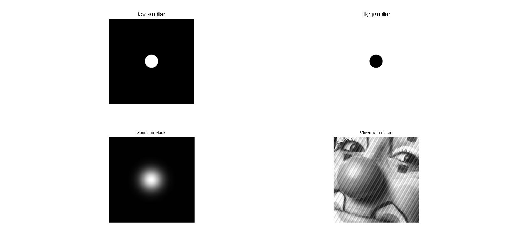
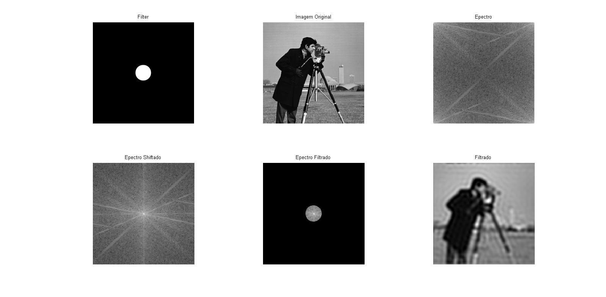
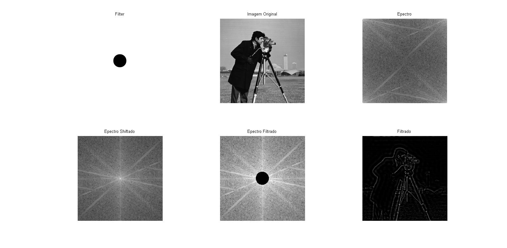
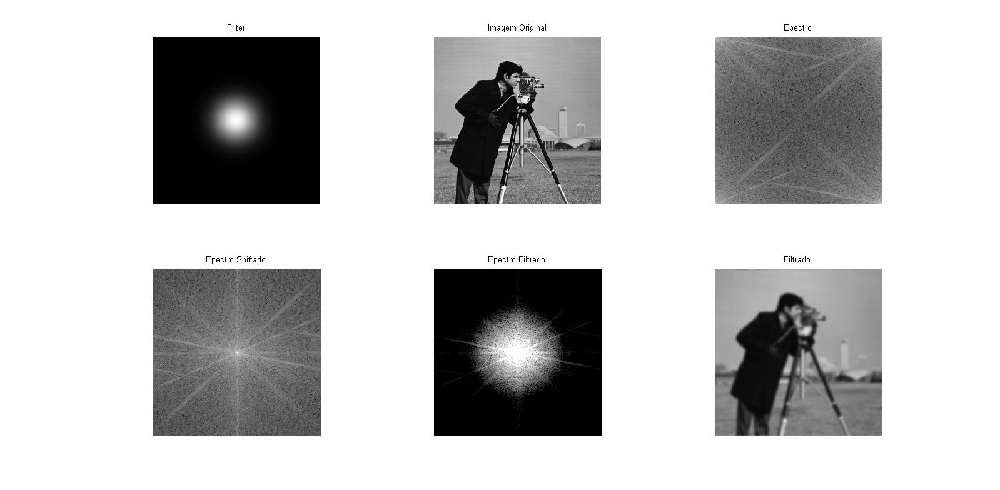
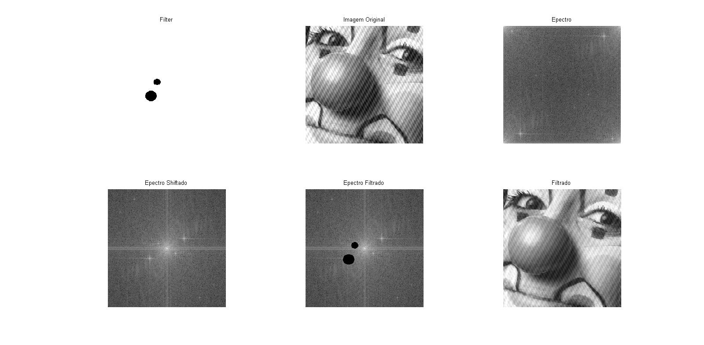

# Fundamentos de Processamento de Imagens

## Laboratório 4

Nome: João Pedro Cosme da Silva / Cartão 0031472

## Introdução

O presente relatório tem como objetivo demonstrar as atividades realizadas no Laboratório 4, que teve como objetivo a realização de operações de filtro no domínio frequência. Foram vistos os filtro passa-baixa,passa-alta e sua utilização na imagem do Cameraman, bem como a filtragem de ruido periódico no domínio frequência.

## Imagens Base

As imagens utilizadas como base para o presente relatório foram carregadas e exibidas conforme abaixo:



<div style="page-break-after: always;"></div>

## Filtros Base no Domínio Frequência (Q2 e Q3)

Para esta questão, a função abaixo foi desenvolvida no MatLab:

```matlab
function quest_dois(image,filter)
    figure();

    subplot(2,3,1);
    imshow(filter);
    title('Filter');
    cameraman = image;

    subplot(2,3,2);
    imshow(cameraman);
    title('Imagem Original');
    cman_fft2 = fft2(cameraman);

    subplot(2,3,3);
    imshow(log(abs(cman_fft2)),[]);
    title('Espectro');

    subplot(2,3,4);
    cman_fft2_shifter = fftshift(cman_fft2);
    imshow(log(abs(cman_fft2_shifter)),[]);
    title('Espectro Shiftado');

    filter_adjusted = double(filter) / double(max(max(filter)));
    filtered = filter_adjusted .* cman_fft2_shifter;

    subplot(2,3,5);
    imshow(log(abs(filtered)),[3 10]);
    title('Espectro Filtrado');

    subplot(2,3,6);
    imshow(uint8(real(ifft2(fftshift(filtered)))));
    title('Filtrado');
end

```

Inicialmente, consideramos que tanto o filtro quanto a imagem ja foram carregados anteriormente através do comando `imread`.

Para a realização da filtragem no domínio frequência, devemos realizar uma operação de multiplicação ponto a ponto entre um filtro e o espectro da imagem que queremos filtrar, filtro este que é obtido através da DFT.

Como o filtro já foi construído visando sua utilização no domínio frequência, ele já possui as características corretas e não necessita ser submetido a DFT. Este filtro, ainda, conta com o espectro da imagem sendo "shiftado" para que as baixas frequências sejam centradas no centro do espectro e não em suas extremidades. Esta premissa é seguida, pois desta forma é mais fácil operar em todas as baixas frequências em um mesmo local no espectro.

Outro ponto importante, é que o filtro foi construído com as mesmas dimensões que a imagem base, pré-requisito básico para a multiplicação ponto a ponto. Caso este não fosse o caso, o filtro deveria ser redimensionado para que possuísse a mesma quantidade de elementos.

Com a imagem já no domínio frequência e com seu espectro "shiftado", o ultimo passo é modular o filtro para que seus valores sejam 0 ou 1. Isto é necessário já que, para mais fácil visualização, o filtro foi construído com o valor de 255 para as partes que se deseja manter. Porém, mantendo esse valor e realizando o produto ponto a ponto, estaríamos realizando um `boosting` dos valores originais do espectro.

O resultado obtido para o filtro "ideal" passa-baixas é o seguinte:



Como podemos ver no resultado final, podemos observar um efeito de anelamento na imagem filtrada. Isto ocorre pois o filtro ideal possui a mudança abrupta entre 0 e 1, de forma que é representado por um filtro _box_, caixa, que representa esta categoria. Este filtro pode ser aproximado pela função $$sinc$$, uma função impar e senoidal centrada na origem, cuja amplitude tende a zero a medida que se afasta dela porém que nunca chega a este valor. Assim, ao realizar o truncamento destas frequências (visto o numero limitado de amostras que podemos utilizar para representar esta imagem), deixamos de considerar diversas frequências que seriam utilizadas para aproximas está função, gerando estes artefatos visuais na imagem.

O mesmo pode ser visto no filtro "ideal" passa alta:



Para evitarmos este efeito, devemos evitar a utilização de um filtro com mudanças tão abruptas. Neste caso, aproximamos o filtro _box_ através de um filtro gaussiano. A este processo damos o nome de janelamento, estamos suavizando o filtro original para que possamos aproximar mais facilmente seu resultado. Neste processo, perdemos algumas frequências devido a aproximação, mas o resultado da imagem final é superior ao utilizando o filtro "ideal".



## Filtragem de Ruídos Periódicos

Para esta questão, o mesmo código que foi visto anteriormente foi utilizado, de forma que não será replicado aqui.

Nesta questão podemos verificar a possibilidade de filtragem precisa de ruídos periódicos através do domínio frequência. Como percebido na imagem, podemos ver dois ruídos periódicos que afetam a imagem. Ao aplicar a DFT na imagem, podemos verificar em seu espectro artefatos relacionados a estas frequências se apresentando como "estrelas" no espectro.

O par mais próximo ao centro está relacionado ao ruido de mais baixa frequência (efeito de linhas mais grossas, da direita para esquerda), enquanto o par mais distante representa o ruído de alta frequência (linhas mais finas). Cada ruído é apresentado como um par, devido a separação de frequências em pares conjugados conforme foi visto na dedução da Transformada, onde cada par representa metade da amplitude de cada frequência.

Tendo estes artefatos visuais, podemos manualmente construir filtros (seguindo as mesmas premissas estabelecidas no item anterior) para eliminar com precisão estes ruídos. Como foram construídos rapidamente, sua simetria e precisão são baixas o que pode gerar o efeito de termos pares conjugados que percam apenas um de seus elementos, porém filtros de mais alta precisão podem ser construídos.

Ao aplicar o filtro construído, podemos ver o resultado abaixo, onde pode-se ver que os ruídos foram eliminados através da aplicação da operação de multiplicação ponto a ponto entre o filtro e o espectro da imagem base.


Ainda, como experimento, tentamos utilizar filtros contendo apenas a parte positiva ou negativa do filtro construído originalmente, como pode ser visto abaixo:




Assim, verificamos experimentalmente a propriedade dos pares conjugados gerados pela DFT, onde, ao eliminar metade dos coeficientes ligados aos ruídos, este ruído se mantém com metade da intensidade, já que apenas metade do par foi removido.
fftshift
