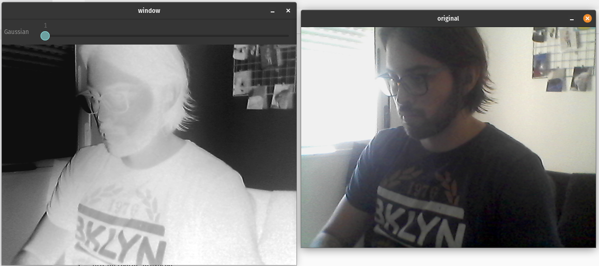

# Fundamentos de Processamento de Imagens

## Trabalho 3

Nome: João Pedro Cosme da Silva / Cartão 0031472

## Introdução

O presente relatório tem como objetivo demonstrar os resultados obtidos utilizando a biblioteca OpenCV para realizar diversas operações sobre imagens em tempo real, através da captura de uma camera conectada a um computador. Neste trabalho, tive a oportunidade de utilizar os conhecimentos adquiridos ao longo dos ultimos dois trabalhos e verificar tanto quanto bibliotecas de alto nivel as usam, como que a possibilidade de aplicar as mesmas operações em video e em tempo real. O trabalho foi desenvolvido utilizando Rust e a biblioteca OpenCV. O controle das operações é enviado via terminal, enquanto a unica interface é a _trackbar_ para o controle do filtro de _blur_.

Abaixo, segue uma imagem da interface geral, onde podemos ver a imagem original e a imagem alterada ao mesmo tempo, e a mensagem exibida no terminal com as instruções:



Mensagem exibida:

```sh
Pressione uma das teclas abaixo para executar um comando:

    h - espelhar horizontalmente

    v - espelhar verticalmente

    n - inverter os valores de cor

    g - converter para escala de cinza

    r - rotacionar em sentido horário

    . - aumentar brilho em 10 pontos

    , - diminuir brilho em 10 pontos

    = - aumentar contraste em 0,1
-   diminuir contraste em 0,1

    b - aplicar filtro de Sobel

    c - aplicar filtro de Canny

    z - redimensionar a imagem

    s - iniciar/parar gravação

    tecla 'q' ou 'esc' - sair do programa
```

Para os seguintes itens, a sua demonstração é encontrada no video no link a seguir, de forma que apenas o item de resize será demonstrado através de _prints_.

## Gaussian

Para a aplicação do filtro gaussiano, foi utilizado o método `gaussian_blur` disponibilizado pela biblioteca de processamento de imagem do OpenCv. Para o controle do nível de borramento, foi utilizado uma _trackbar_ para ajustar o tamanho do filtro aplicado. Porém, como a biblioteca requer que o filtro seja quadrado e de dimensões impares, um pequeno tratamento para garantir isso foi aplicado como pode ser visto na função `apply_gaussian` do módulo de video_ops.

## Canny

Para a utilização do filtro `canny`, cujo resultado é a detecção de arestas no vídeo, inicialmente é aplicado um filtro gaussiano para reduzir o ruido presente originalmente na captura da camera. O algoritmo Canny apresenta um resultado semelhante ao filtro LaPlaciano visto no trabalho anterior. Experimentalmente, os _thesholds_ com melhor resultado foram os de valor 40 e 100.

## Sobel

Para o cálculo da gradiente de uma imagem, foi utilizado a função `Sobel` dada pelo OpenCV. Como pré-processamento, também é utilizado um filtro gaussiano e uma conversão para tons de cinza para preparar a imagem para o cálculo. Em seguida, calculamos a derivada da imagem em dx e dy, somamos o módulo destes resultados e apresentamos a nova imagem.

## Operações Lineares

Para a utilização de operações lineares, foi usado o método `convert_to`, onde podemos aplicar uma operação linear sobre uma imagem enviando o ganho e o bias necessário. A partir disto, derivamos os três métodos abaixo:

- Negativo : Implementado por `apply_negative`
- Brilho: Implementado por `apply_bright_adjustment`, o usuario pode ajustar o brilho em saltos de +10 ou -10
- Contraste: Implementado por `apply_contrast`, o usuario pode fazer ajustes incrementais de +0.1 a -0.1

## Tons de Cinza

A biblioteca OpenCv oferece o método `cvt_color` para realizar a conversão dos tons de uma imagem. Utilizando o codigo `COLOR_BGR2GRAY` podemos realizar a conversão em uma única linha.

## Redimensionamento do Video

O usuário pode reduzir o frame pela metade de seu tamanho original e retornar ao tamanho original. Este comando não pode ser utilizado enquanto o modo de gravação está ativado.

Isto é executado através do comando `resize` disponibilizado pelo OpenCv.

## Rotação de 90 Graus

O usuário pode rotacionar o video em 90 graus quantas vezes desejar. Para isso, foi utilizado o comando `rotate` aplicado de maneira repetida de acordo com a quantidade de vezes o usuário deseja rotacionar a tela.

## Espelhamento de Video

Utilizando o comando `flip` da biblioteca OpenCV, a realização do espelhamento também é aplicada em uma unica linha utilizando o comando `flip`. A partir deste, os métodos `apply_mirror_horizontal` e `apply_mirror_vertical` foram criados.

## Gravação de Video

OpenCV também oferece um módulo de `VideoWriter` onde podemos gravar videos e salva-los. Este comando foi utilizado para gravar o video disponibilizado acima. A partir do momento do inicio da gravação, não é mais permitido o redimensionamento do vídeo capturado para fins de compatibilidade de tamanho de captura.

## Conclusão

Este trabalho foi útil para vivenciar não somente a captura de videos e a operação sobre estes dados em tempo real, mas também para verificar a utilização de bibliotecas que facilitam este trabalho e validar os conhecimentos adquiridos anteriormente e conferir com os resultados obtidos por minha própria implementação nos trabalhos anteriores.
